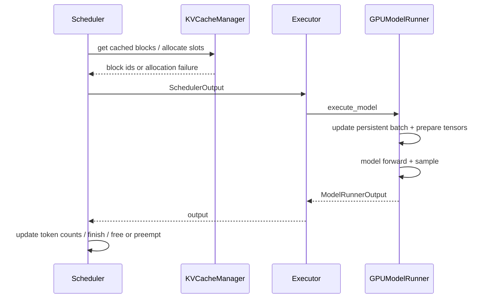

# 一条 vLLM 请求的生命周期

我们固定一条最小路径：`/v1/chat/completions`、纯文本、`n=1`、流式、temperature=0、TP=DP=PP=1。复杂功能以后只是在这条主干上增加数据或分支。

## 全程先看“数据变成了什么”

```mermaid
flowchart LR
    A[ChatCompletionRequest] --> B[conversation]
    B --> C[engine input / token ids]
    C --> D[EngineCoreRequest]
    D --> E[Request in waiting/running]
    E --> F[SchedulerOutput]
    F --> G[GPU input tensors]
    G --> H[logits / sampled token ids]
    H --> I[EngineCoreOutput]
    I --> J[RequestOutput]
    J --> K[SSE ChatCompletionChunk]
```



如果只跟函数名，很容易在几十层 adapter 中迷路。每跨一层都记录数据类型、所属进程和谁能修改它。

## 阶段 1：HTTP 请求被渲染成模型输入

FastAPI route [`create_chat_completion()`](https://github.com/vllm-project/vllm/blob/61141ed265bfef41a0ca19e992567ea980919b96/vllm/entrypoints/openai/chat_completion/api_router.py#L53) 取得 `OpenAIServingChat`，调用其同名方法。服务层做的工作包括：

1. 校验请求中的模型与能力；
2. 用 chat template 把 `messages` 渲染成模型期望的序列；
3. 处理 tools、reasoning parser、多模态输入与 LoRA 等可选信息；
4. 把 OpenAI 参数转换为内部 `SamplingParams`；
5. 生成唯一 request id；
6. 调用 `engine_client.generate()`。

关键源码是 [`OpenAIServingChat._create_chat_completion()`](https://github.com/vllm-project/vllm/blob/61141ed265bfef41a0ca19e992567ea980919b96/vllm/entrypoints/openai/chat_completion/serving.py#L246)。

::: tip 第一个常见误判
回答角色错乱、特殊 token 泄漏或工具调用格式错误，通常发生在 renderer/chat template/parser 层，还没进入 Scheduler。此时调 KV cache 没有意义。
:::

## 阶段 2：AsyncLLM 建立前端状态并跨进程入队

[`AsyncLLM.generate()`](https://github.com/vllm-project/vllm/blob/61141ed265bfef41a0ca19e992567ea980919b96/vllm/v1/engine/async_llm.py#L524) 是异步生成器。它先调用 `add_request()`，后者完成：

- `InputProcessor` 把 engine input 转成可序列化的 `EngineCoreRequest`；
- `OutputProcessor` 注册前端请求状态与输出 collector；
- Core client 经 ZMQ 把请求送往 EngineCore；
- 为调用方返回一个 per-request queue。

最容易忽略的顺序是：**前端先登记输出接收者，再把请求发给 Core。**否则极快的输出可能先到，而前端还不知道投递到哪条流。

`EngineCoreRequest` 的核心字段包括：

```text
request_id
prompt_token_ids / prompt_embeds / multimodal features
sampling_params or pooling_params
arrival_time / priority
lora_request / cache_salt / data_parallel_rank
client_index
```

它是 API/Core 边界的数据契约，而不是整个 HTTP 请求对象。

## 阶段 3：Core 把传输对象变成调度对象

EngineCore process 的输入线程解码消息后，`preprocess_add_request()` 构造 Core 内部 `Request`，再由 [`EngineCore.add_request()`](https://github.com/vllm-project/vllm/blob/61141ed265bfef41a0ca19e992567ea980919b96/vllm/v1/engine/core.py#L430) 交给 `Scheduler.add_request()`。

此时请求进入 waiting queue。它携带的几个数字贯穿后面所有 step：

| 字段 | 直觉 |
| --- | --- |
| `num_prompt_tokens` | 原始 prompt token 数 |
| `num_computed_tokens` | 已完成 forward、可依赖的 token 位置数 |
| `num_tokens_with_spec` | prompt + 已生成 + draft 等当前需要追上的位置 |
| `max_tokens` | 最多允许生成多少输出 token |

V1 Scheduler 不需要固定的“prefill 阶段状态机”和“decode 阶段状态机”；每轮只计算还差多少 token。长 prompt 被 chunk、命中 prefix 或带 speculative tokens，都可以表示成 `需要的 token - 已计算的 token`。

## 阶段 4：一次 EngineCore step

[`EngineCore.step()`](https://github.com/vllm-project/vllm/blob/61141ed265bfef41a0ca19e992567ea980919b96/vllm/v1/engine/core.py#L546) 的骨架非常短：

```python
scheduler_output = scheduler.schedule(...)
future = model_executor.execute_model(scheduler_output, non_block=True)
model_output = future.result()
engine_core_outputs = scheduler.update_from_output(
    scheduler_output, model_output
)
```

短不等于简单。复杂性被压进两个稳定契约：Scheduler 负责“这一轮做谁、做多少、用哪些 block”，Runner 负责“按计划构造 GPU batch 并执行”。

一次 step 的因果链：



若 KV 分配失败，Scheduler 可能 preempt 低优先级/队尾请求，释放其 block 后重试。这就是为何某条请求的 `num_computed_tokens` 可能需要重新追赶，而不是永远单调对应“已付出的 GPU 计算成本”。

## 阶段 5：Worker 执行与采样

Executor 把同一个逻辑方法发到 worker。单 GPU 时最终由 [`GPUWorker.execute_model()`](https://github.com/vllm-project/vllm/blob/61141ed265bfef41a0ca19e992567ea980919b96/vllm/v1/worker/gpu_worker.py#L1002) 进入 `GPUModelRunner`。

Runner 维护一个跨 step 的 persistent batch，而不是每轮从零构造所有请求。它根据 `SchedulerOutput`：

1. 移除 finished/preempted 请求；
2. 加入新请求，更新已有请求的 token 与 block table；
3. 为本轮 scheduled tokens 准备 position、slot mapping、attention metadata；
4. 运行模型 forward；
5. 对 logits 应用 sampling、penalty、grammar 等规则；
6. 返回 sampled token ids 与附加输出。

在 TP>1 时，多个 worker 共同执行一份逻辑模型，collective 位于模型/并行层；不是四个 Scheduler 各生成一个 token 再投票。

## 阶段 6：结束判断与状态回收

[`Scheduler.update_from_output()`](https://github.com/vllm-project/vllm/blob/61141ed265bfef41a0ca19e992567ea980919b96/vllm/v1/core/sched/scheduler.py#L1533) 将采样结果合并回请求状态，并处理：

- 新 token 与接受的 speculative tokens；
- `max_tokens`、EOS、stop token 等结束条件；
- structured output 状态；
- preemption、KV connector 与异步完成；
- finished 请求的 block 释放。

stop **字符串**需要 detokenized text，部分判断会在前端 OutputProcessor 完成；它可能再向 Core 发 abort，停止已经不需要的继续生成。这说明“谁判断结束”不是唯一函数，而是按数据所有权分层：token 级条件靠 Core，文本级条件靠前端。

## 阶段 7：输出回到原 HTTP 流

Core 把 `EngineCoreOutputs` 发回 API process。`AsyncLLM` 的后台 [`output_handler()`](https://github.com/vllm-project/vllm/blob/61141ed265bfef41a0ca19e992567ea980919b96/vllm/v1/engine/async_llm.py#L656)：

1. 从 Core client 拉取一批输出；
2. 交给前端 `OutputProcessor` 做 detokenize、logprob、stop string 等处理；
3. 把 `RequestOutput` 放入对应 request collector；
4. 更新指标。

与此同时，`generate()` 正在等待同一个 collector，拿到增量输出后 `yield` 给 OpenAI serving 层；后者编码为 SSE `data:` chunks。于是一个 EngineCore 批次可以同时唤醒多个互不相关的 HTTP 流。

## TTFT 花在哪里

```text
TTFT ≈ HTTP/排队 + render/tokenize + Core queue
     + prompt compute（可能多次 chunk）
     + first sample + detokenize/stream/network
```

看到 TTFT 高，不能直接归因于 prefill kernel。用时间戳与指标逐段排除：

| 区间 | 证据 |
| --- | --- |
| 到达 → Core queued | HTTP middleware / trace |
| queued → scheduled | EngineCore event、waiting 指标 |
| scheduled → first model output | iteration/profile、prompt token 数 |
| Core output → client first byte | OutputProcessor、event loop、网络 trace |

## 客户端断开不是小事

`AsyncLLM.generate()` 捕获 `CancelledError` / `GeneratorExit` 后调用 `abort()`。abort 同时清理前端 OutputProcessor 状态并向 EngineCore 发请求；Core 最终让 Scheduler finish request、释放资源。

如果网关超时但取消没有传递，GPU 可能继续为已经无人接收的答案生成。压测时只统计客户端 timeout 而不看 running/KV 回落，会漏掉这种“幽灵请求”。

## 手工追踪练习

用 `max_tokens=3` 的确定性请求，做一张表：

| step | waiting/running | computed | scheduled | new blocks | sampled | finished |
| ---: | --- | ---: | ---: | --- | --- | --- |
| 1 |  |  |  |  |  |  |
| 2 |  |  |  |  |  |  |
| 3 |  |  |  |  |  |  |
| 4 |  |  |  |  |  |  |

先假设 prompt 无 prefix hit 且能一次 prefill，再分别加入“prompt 超过 batch token budget”和“命中一个完整 block 的 prefix”，重画变化。目标是能预测字段，而不是抄日志。

## 通关标准

从 `ChatCompletionRequest` 开始，口述到 SSE chunk 的十次数据变形；指出两个跨进程边界；解释 stop token 与 stop string 为什么可能由不同层完成；说明断连如何释放 KV。下一课深入 [Scheduler 与 KV Cache](./scheduler-kv)。
