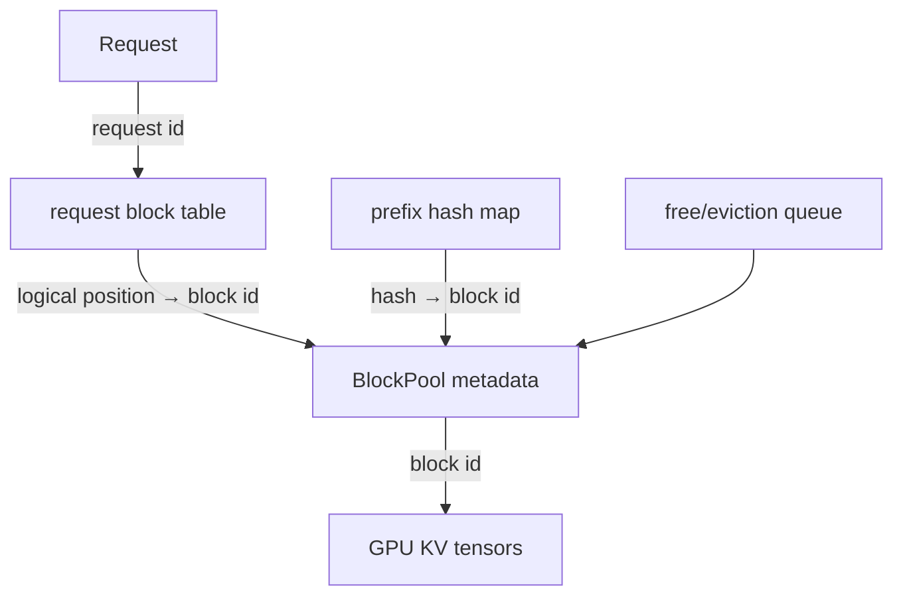
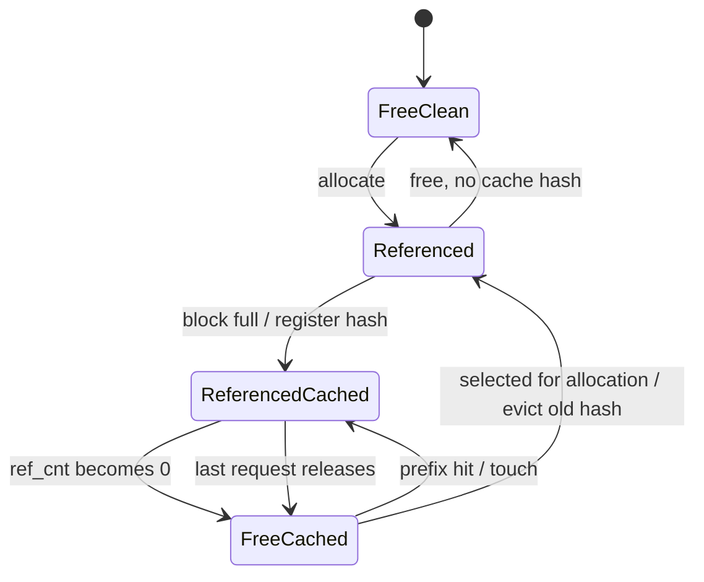
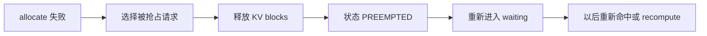

# Scheduler 与 KV Cache Manager

Scheduler 不是简单的请求队列。它同时求解两个预算：本 step 最多计算多少 token，以及这些 token 的 KV 状态能否放进有限 block pool。前者约束计算批，后者约束并发驻留；二者任何一个用完都可能让请求等待。

## V1 的统一 token 差额模型

固定源码在 [`Scheduler.schedule()`](https://github.com/vllm-project/vllm/blob/61141ed265bfef41a0ca19e992567ea980919b96/vllm/v1/core/sched/scheduler.py#L417) 开头明确写道：没有独立的 decode phase 或 prefill phase。对每个请求先算：

$$
n_{new} = n_{tokens\_with\_spec} + n_{placeholders} - n_{computed}
$$

再受本轮 token budget、模型最大长度、long-prefill threshold 等约束。这个抽象同时容纳：

| 情况 | 差额如何出现 |
| --- | --- |
| 普通 prefill | prompt 很长，computed 从 0 追到 prompt length |
| chunked prefill | 一轮预算不足，只追一部分 |
| decode | 新采样 token 加入已有序列，下一轮通常只差少量位置 |
| prefix hit | computed 直接前移到已缓存的完整前缀 |
| speculative | `spec_token_ids` 让待验证位置一次增加多个 |
| preemption/recompute | KV 被释放，computed 回退，之后重新追赶 |

因此阅读代码时用“context/生成 token 差额”比到处写 `if prefill else decode` 更接近实现。

## 一轮 schedule 的优先顺序

删去多模态、KV connector、structured output 等分支后，主干是：

```text
token_budget = max_num_scheduled_tokens
1. 遍历 running 请求
   - 计算 num_new_tokens
   - 尝试 allocate_slots
   - 失败则 preempt，释放后重试
   - 成功则扣 token_budget
2. 若 running 未触发抢占，再从 waiting 队列接纳
   - 查 prefix hit
   - 分配 cached + new slots
   - 受 max running requests / token budget / KV blocks 约束
3. 构造 SchedulerOutput
```

先服务 running 有助于稳定 decode latency；chunked prefill 让长 prompt 不必独占一个巨型 step。waiting 的选择默认受队列 policy（如 FCFS 或 priority）影响，但某个请求因 encoder budget、远程 KV 等原因暂不可运行时，代码可能跳过它去找后续可运行者，所以“FCFS”不等于任何 feature 下严格 head-of-line blocking。

## `SchedulerOutput` 是控制计划

它至少回答四类问题：

| 问题 | 典型字段/结构 |
| --- | --- |
| 本轮有哪些新、恢复、已有请求 | `scheduled_new_reqs` / cached request data |
| 每条请求算几个 token | `num_scheduled_tokens` |
| 新分配或更新了哪些 block | request block ids / new block data |
| 哪些 feature 需要额外输入 | speculative token、encoder input、grammar、KV connector data |

Runner 不重新做服务级调度；它执行这张计划。若往 Scheduler 添加 feature，最重要的设计问题通常是“要在 `SchedulerOutput` 增加什么最小数据契约”。

## KV 的三层结构



- `KVCacheManager`：面向请求，管理查命中、分配 slots、free 与统计；
- `BlockPool`：面向全局 block，管理 block id、hash、引用计数和 free/eviction queue；
- Worker KV tensor：真正的 K/V 数值，Scheduler 只通过 block id 指挥读写。

固定入口：[`KVCacheManager`](https://github.com/vllm-project/vllm/blob/61141ed265bfef41a0ca19e992567ea980919b96/vllm/v1/core/kv_cache_manager.py#L114)、[`BlockPool`](https://github.com/vllm-project/vllm/blob/61141ed265bfef41a0ca19e992567ea980919b96/vllm/v1/core/block_pool.py#L143)。

## Prefix cache 为什么用链式 hash

一个 block 的 key 不只由本 block token 决定：

$$
h_i = H(h_{i-1},\ tokens_i,\ extra_i)
$$

`extra` 可包含 LoRA id、多模态内容 hash、cache salt 等。于是相同的局部 token 只有在前缀语境也相同的情况下才命中。

```text
block 0: hash(None,     [A B C D], extras)
block 1: hash(hash_0,   [E F G H], extras)
block 2: hash(hash_1,   [I J K L], extras)
```

普通 full-attention 缓存主要复用完整 block。若 prompt 全部命中，仍需重算最后一个 token 以得到 logits；固定源码的 `get_computed_blocks()` 因 block 对齐可能重算最后一个完整 block，而不是只重算一个位置。

### 命中不是复制 KV

命中后 `touch()` 增加 block 的 `ref_cnt`，并把此前处于可淘汰队列、但现在重新被引用的 block 移出 free queue。多个请求可以指向同一物理 block；只有引用归零，它才重新成为可分配/可淘汰候选。

这正是分页的价值：请求的逻辑前缀不需要在显存中连续，也无需把一大段 KV 拷贝到每个请求私有区。

## Block 生命周期



“free”在 prefix caching 开启后不等于内容立即清零。`ref_cnt=0` 的 cached block 可以留在 eviction queue 中等待复用；只有它真的被拿来承载新内容时，旧 hash 映射才被移除。这样缓存不需要额外显存池。

固定源码用双向链表维护 free queue，让 touch/removal 和队列调整保持常数时间。释放请求时对 block 顺序也有策略：更靠后的长前缀通常复用概率更低，会更早成为淘汰候选。

## `allocate_slots()` 为什么返回 `None`

[`allocate_slots()`](https://github.com/vllm-project/vllm/blob/61141ed265bfef41a0ca19e992567ea980919b96/vllm/v1/core/kv_cache_manager.py#L283) 要同时容纳：已有 computed、刚命中的 cached、外部 connector 提供的 KV、本轮 new token、speculative lookahead，以及 encoder/混合模型的 cache group。

简化计算：

$$
blocks_{need}=\left\lceil\frac{tokens_{resident}+tokens_{new}+tokens_{lookahead}}{block\ size}\right\rceil-blocks_{owned}
$$

若 free candidates 不足，函数不做半截破坏性分配，而返回 `None`。Scheduler 再决定：

- 对 running 请求，preempt 某个请求后重试；
- 对 waiting 请求，本轮停止接纳或尝试其他可运行请求；
- 对异步外部 KV，考虑 reserved blocks，避免 transfer 占住空间却无法推进形成死锁。

实际实现还要处理 sliding-window、Mamba 等不同 cache spec，因此可能有多个 KV cache group；不要把所有模型都假设成一张同构 K/V block table。

## Preemption 是容量阀，不是免费排队

V1 默认以 recompute 方式 preempt：释放该请求的 KV blocks，把状态放回可恢复队列，之后重新计算必要上下文。



它保证系统在压力下还能前进，却会浪费之前的算力并恶化 E2E/TTFT。频繁 preemption 通常意味着：KV 容量过小、并发/批预算过激、上下文尾部过长，或并行策略没有给缓存留下足够显存。它不是“Scheduler 很聪明，所以不用规划容量”。

## 一个纸上调度实验

设 block size=4、总 block=6、本轮 token budget=6：

- A：running，已有 5 token KV，本轮 decode 1；
- B：running，已有 3 token KV，本轮 decode 1；
- C：waiting，prompt 8 token，其中前 4 token prefix hit；
- D：waiting，prompt 6 token，无命中。

逐步回答：

1. A 和 B 各是否需要新 block？注意 partial block 是否还有 slot。
2. 扣除 running 的 token budget 后，C 本轮最多算几个未缓存 token？
3. C 命中的 block `ref_cnt` 怎样变化？
4. 如果第 6 个 block 已是 ref=0 的 cached block，拿来给 C 时发生“复用”还是“淘汰”？取决于 hash 是否匹配。
5. D 为什么可能仍等待：token budget、running limit、block 三种约束分别检查。

然后把 C 的 prompt 改成 9 token。即使前 8 token 的两个 full blocks 都命中，为产生 next-token logits，当前实现最多能把 computed 直接推进到哪里？

## 从指标反推内部状态

| 观测 | 内部假设 | 验证方法 |
| --- | --- | --- |
| prefix hit 高但 TTFT 收益小 | 剩余 prompt/排队占主导，或命中边界要重算 | 按命中 token 数分桶，控制 queue time |
| KV usage 长期接近 1 且 preemption 增 | block pool 无余量 | 降并发/长度或增可用 KV 后对照 |
| running 不高但 waiting 高 | token budget、feature gate 或运行上限 | 看 scheduled tokens 和 request status |
| 提高 batch tokens 后 ITL 变差 | 更大 context work 与 decode 同批 | 分开看 context/generation token 数 |
| DP 扩容后 prefix hit 降 | 相似前缀被分散到独立 rank cache | 做 prefix-aware routing 对照 |

## 阅读顺序

1. 只读 `schedule()` 开头的 running loop，写出 token budget 的所有 `min()`。
2. 读 waiting admission 中 `get_computed_blocks()` → `allocate_slots()` → `RUNNING`。
3. 读 `BlockPool.touch()`、`get_new_blocks()`、`free_blocks()`，画 ref count。
4. 最后读 `update_from_output()` 中 sampled token、stop、free；暂时跳过 routed experts 和 connector 分支。

## 通关标准

给定请求的 prompt、已生成 token、prefix hit、block size、free block 数和 token budget，你应能手算本轮 scheduled token 与 block 变化；还要解释 ref=0 cached block 为什么既“free”又保留内容。下一课进入 [Worker、Runner 与模型执行](./model-execution)。
