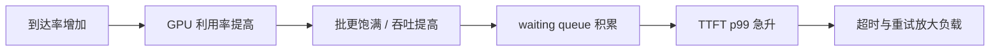

# vLLM 基准测试与调参

一个没有工作负载定义的 tok/s 数字几乎不可比较。先固定模型、硬件、软件版本、输入/输出长度分布和到达过程，再谈配置优劣。本课建立三种互补实验，而不是寻找一条“万能 benchmark 命令”。

## 先写下实验契约

至少固定以下变量：

| 类别 | 必须记录 |
| --- | --- |
| 系统 | GPU 型号/数量、驱动、vLLM/PyTorch/CUDA 版本 |
| 模型 | 仓库与 revision、dtype、量化、TP/PP/DP |
| 缓存 | 最大上下文、KV dtype、prefix caching 是否开启 |
| 负载 | prompt/output token 分布、请求数、到达率、并发上限 |
| 质量 | temperature、stop、是否忽略 EOS |
| 指标 | TTFT、TPOT/ITL、E2E 的 p50/p95/p99，成功率与吞吐 |

输入“字符数”不是 token 长度；不同 tokenizer 下不可比较。输出若允许自然 EOS，两个模型生成长度不同也会污染性能结论。

## 实验 A：找最大吞吐上限

保持[上一课](./first-server)的服务运行，在另一个终端执行：

```bash
export MODEL=Qwen/Qwen2.5-0.5B-Instruct

vllm bench serve \
  --backend vllm \
  --model "$MODEL" \
  --endpoint /v1/completions \
  --dataset-name random \
  --random-input-len 1024 \
  --random-output-len 128 \
  --num-prompts 500 \
  --request-rate inf \
  --ignore-eos \
  --save-result \
  --result-dir ./bench-results
```

`request-rate=inf` 会尽快提交请求，适合测饱和吞吐，不代表真实用户流量。`--ignore-eos` 让每条请求生成指定长度，便于系统对照；它不代表真实产品行为。

关注成功请求数、output/total token throughput，以及高分位延迟。若只报告平均值，排队长尾会被隐藏。

## 实验 B：模拟开放到达流量

把到达率设为有限值，并扫描它：

```bash
for rate in 1 2 4 8 16; do
  vllm bench serve \
    --backend vllm \
    --model "$MODEL" \
    --endpoint /v1/completions \
    --dataset-name random \
    --random-input-len 1024 \
    --random-output-len 128 \
    --num-prompts 300 \
    --request-rate "$rate" \
    --ignore-eos \
    --save-result \
    --result-dir "./bench-results/rate-$rate"
done
```

默认的有限 `request-rate` 近似开放到达过程：请求是否到达不因上一条是否完成而停止。随着 rate 接近系统服务能力，排队时间会非线性上升：



拐点前的稳定区域通常比曲线最右端更适合作为生产容量。

## 实验 C：直接测 SLO goodput

吞吐计算“完成了多少”；goodput 只计算在服务目标内完成了多少。例如产品要求 TTFT ≤ 500 ms、TPOT ≤ 50 ms：

```bash
vllm bench serve \
  --backend vllm \
  --model "$MODEL" \
  --endpoint /v1/completions \
  --dataset-name random \
  --random-input-len 1024 \
  --random-output-len 128 \
  --num-prompts 500 \
  --request-rate 8 \
  --ignore-eos \
  --goodput ttft:500 tpot:50
```

阈值只是示例，必须来自你的产品体验与网关超时。若总吞吐升高而 goodput 下降，新增完成量主要是“不合格请求”。

## 读取四组指标

| 指标变化 | 常见解释 | 下一步证据 |
| --- | --- | --- |
| TTFT 高，ITL 尚可 | 排队或长 prefill | waiting、prompt 长度、prefill token 比例 |
| TTFT 尚可，ITL 高 | decode 批过重或通信/带宽瓶颈 | running、batch tokens、TP collective profile |
| 两者都高，GPU 低利用 | CPU/tokenizer、请求间隙、同步或网络 | CPU profile、到达时间线、NCCL 日志 |
| 吞吐高但 p99 失控 | 已越过稳定工作点 | rate sweep 与 queue 曲线 |
| preemption 增长 | KV 容量或调度预算紧张 | KV usage、上下文分布、启动时 KV capacity |

TPOT（time per output token）常按“去掉首 token 后的生成时长 / 后续 token 数”计算；ITL 是相邻流式 token 的间隔分布。二者相关，但在异步网络流式传输中不完全等价。

## 用单变量矩阵调参

先保留一组 baseline，再一次只动一个参数：

| 轮次 | 变量 | 候选值 | 主要观察 |
| --- | --- | --- | --- |
| 0 | baseline | 默认 + 明确模型配置 | 可复现性 |
| 1 | `max-num-batched-tokens` | 2048 / 4096 / 8192 / 16384 | TTFT–ITL–吞吐权衡 |
| 2 | `max-num-seqs` | 受控递增 | 并发、KV 占用、preemption |
| 3 | prefix caching | off / on | 重复前缀工作负载的 hit 与 TTFT |
| 4 | optimization level | O0 / O1 / O2 | 启动成本与稳态性能 |
| 5 | TP size | 仅在模型/显存需要时 | 单卡余量与 collective 开销 |

在 V1 中，chunked prefill 可用时默认开启。较小 `max-num-batched-tokens` 往往保护 decode 的 ITL，较大值可能改善 prefill/TTFT 与吞吐，但结果取决于模型、GPU 和长度分布。它是实验变量，不是背诵答案。

### 为什么不同时改三项

假设把 TP 从 1 改 2、batch token 从 4096 改 16384、prefix cache 同时打开，吞吐上涨了 20%。你无法知道收益来自多余显存、批大小、缓存命中，还是三者交互；也无法在另一个流量分布复用结论。

## 加入真实数据

随机 token 适合控制长度，却不代表真实 prefix 重复、chat template、stop 与输出分布。第二阶段改用脱敏生产样本或 ShareGPT 类数据：

```bash
vllm bench serve \
  --backend openai-chat \
  --model "$MODEL" \
  --endpoint /v1/chat/completions \
  --dataset-name custom \
  --dataset-path ./sanitized-prompts.jsonl \
  --num-prompts 500 \
  --request-rate 8 \
  --save-result \
  --save-detailed
```

先运行 `vllm bench serve --help` 核对所安装版本对 custom/chat 的字段要求。基准 CLI 是活跃接口；课程固定源码中的[官方 Benchmark 文档](https://github.com/vllm-project/vllm/blob/61141ed265bfef41a0ca19e992567ea980919b96/docs/benchmarking/cli.md)也明确区分功能/回归基准与更完整的生产压测工具。

## 结果表应该长这样

```text
experiment_id:
server_command + env:
benchmark_command + dataset hash:
warmup policy:
success / failure / timeout:
request, output-token, total-token throughput:
TTFT p50/p95/p99:
TPOT p50/p95/p99:
ITL p50/p95/p99:
goodput under explicit SLO:
peak KV usage / preemptions / waiting:
conclusion and next single variable:
```

重复至少三次，报告离散程度。第一次运行可能包含冷缓存、模型编译或连接建立，不能悄悄与稳态运行混在一起。

## 通关标准

你需要能独立解释三点：饱和吞吐与开放到达负载为什么不同；为什么 p99 与 goodput 比平均 tok/s 更接近线上体验；为什么只改变一个变量。下一节开始把这些观测映射回[V1 多进程架构](../internals/architecture)。
