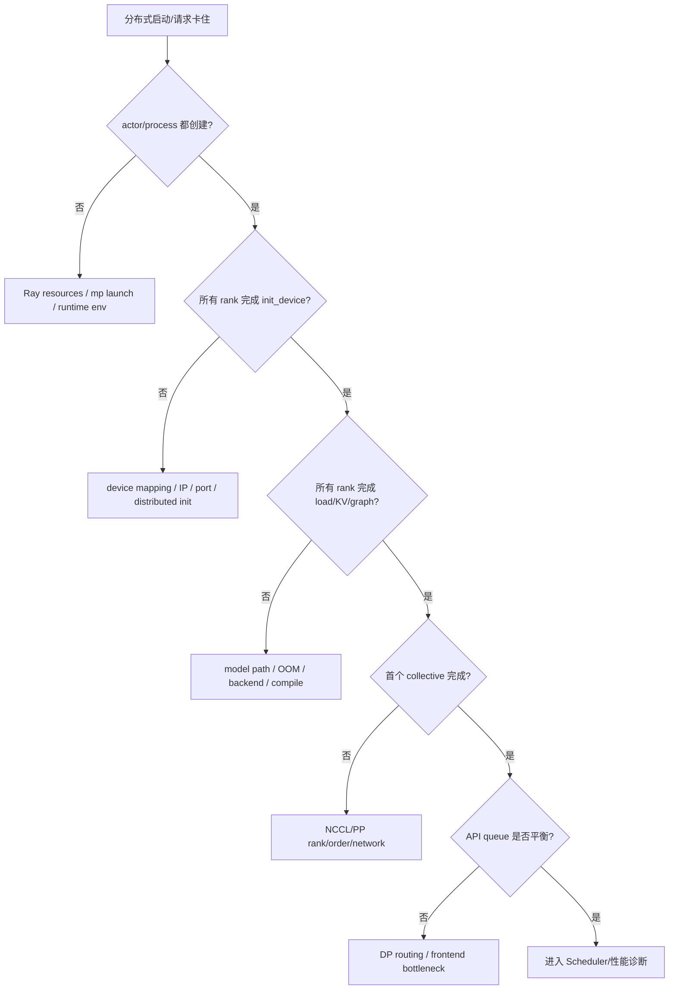

# vLLM 分布式实战：TP、PP、DP、Ray 与多节点逐层验收

实验原则：一次只增加一层复杂度。

```text
single GPU
→ single-node TP with mp
→ single-node TP with Ray
→ PP×TP
→ DP×(PP×TP)
→ multi-node Ray / mp
```

若前一层没有功能、rank 和性能基线，不进入后一层。否则出现 hang 时无法区分模型、显存、进程启动、资源放置、端口、rank、NCCL 还是负载均衡。

所有实现解释绑定 vLLM `61141ed265bfef41a0ca19e992567ea980919b96`；命令参数在执行前仍要用安装版本 `vllm serve --help` 核对。

::: danger 可信网络
Ray control plane、vLLM 内部 RPC/ZMQ 与分布式 tensor 通信只放在可信私网。固定提交的官方多节点文档明确说明内部流量未必加密，数据格式也不应暴露给不可信主体。
:::

## 0. 先写清实验问题

不要以“让 8 张 GPU 都亮”为目标。选择一个问题：

| 问题 | 优先策略 | 需要反证什么 |
| --- | --- | --- |
| 单卡放不下权重/KV | 节点内 TP | collective 是否抵消收益 |
| 跨节点容纳大模型 | 节点内 TP + 节点间 PP | stage 是否失衡、bubble 是否过大 |
| 模型可复制、吞吐不足 | DP | API/路由是否成瓶颈、KV/prefix 是否失衡 |
| 统一跨节点资源编排 | Ray executor | actor/placement 开销是否值得 |
| 无 NVLink、层可切 | PP 对照 | 单请求 latency 与 stage 等待 |

固定工作负载：同一模型 revision、dtype、最大上下文、输入/输出 token 分布、sampling、到达率与 warmup。每个拓扑至少记录：

```text
ready time
process / actor / rank placement
per-GPU weight and KV capacity
TTFT / ITL / E2E p50,p95,p99
request/output-token/goodput
GPU memory/utilization
NCCL or PP communication evidence
errors / preemption / queue balance
```

每个新终端、每个节点都先执行同一环境块；也可把 `MODEL` 换成本地快照，但必须保留可追溯 revision。`logs/` 从空工作目录自动创建，所有带 `tee` 的启动块都启用 `pipefail`，否则服务启动失败可能被 `tee` 的退出码掩盖。

```bash
export MODEL=Qwen/Qwen3-0.6B
export MODEL_REVISION=c1899de289a04d12100db370d81485cdf75e47ca
mkdir -p logs
```

## 1. 拓扑账本先算对

固定提交 [`ParallelConfig.world_size`](https://github.com/vllm-project/vllm/blob/61141ed265bfef41a0ca19e992567ea980919b96/vllm/config/parallel.py#L792-L800) 对一个 replica 主要计算 `PP × TP × prefill-context-parallel`；普通 PCP=1 时是 `PP×TP` worker。DP 再复制 Core/replica。

对普通 dense 模型：

```text
workers = DP × PP × TP
EngineCore processes ≈ DP
KV cache pools = DP replicas × each replica's worker shards
```

例 `DP=2, PP=2, TP=4`：总 16 GPU workers、2 个 Scheduler/Core；每个 Core 驱动 8 workers。不是一个 Scheduler 管 16 卡的单模型，也不是 16 个独立 Scheduler。

MoE + EP 时 group 关系更复杂；不要把 EP 无条件再乘进 GPU 总数。官方固定文档见 [`data_parallel_deployment.md`](https://github.com/vllm-project/vllm/blob/61141ed265bfef41a0ca19e992567ea980919b96/docs/serving/data_parallel_deployment.md)。

## 2. 基线 A：单 GPU

```bash
set -o pipefail
CUDA_VISIBLE_DEVICES=0 vllm serve "$MODEL" \
  --revision "$MODEL_REVISION" \
  --tokenizer-revision "$MODEL_REVISION" \
  --host 127.0.0.1 \
  --port 8000 \
  --max-model-len 4096 \
  --generation-config vllm \
  2>&1 | tee logs/single.log
```

验收：

- 启动日志显示 world size 1、Executor/Runner/backend；
- 权重加载、KV capacity、compile/graph 完成；
- 确定性、流式、取消和固定 benchmark 全通过；
- 保存 per-GPU 显存和性能基线。

若模型单卡放不下，换一个教学小模型建立功能基线；大模型 OOM 只能证明需要更多容量，不能跳过正确性基线。

## 3. 基线 B：单节点 TP=2 + multiprocessing

```bash
set -o pipefail
CUDA_VISIBLE_DEVICES=0,1 vllm serve "$MODEL" \
  --revision "$MODEL_REVISION" \
  --tokenizer-revision "$MODEL_REVISION" \
  --host 127.0.0.1 \
  --port 8001 \
  --tensor-parallel-size 2 \
  --distributed-executor-backend mp \
  --max-model-len 4096 \
  --generation-config vllm \
  2>&1 | tee logs/tp2-mp.log
```

源码路径：backend 由 [`Executor.get_class()`](https://github.com/vllm-project/vllm/blob/61141ed265bfef41a0ca19e992567ea980919b96/vllm/v1/executor/abstract.py#L47-L92) 选择 `MultiprocExecutor`；Worker 在 [`init_worker_distributed_environment()`](https://github.com/vllm-project/vllm/blob/61141ed265bfef41a0ca19e992567ea980919b96/vllm/v1/worker/gpu_worker.py#L1326-L1364) 初始化 world/TP/PP groups。

模型层 TP 证据：

- column parallel 本地 matmul、可选 all-gather：[`linear.py:551–569`](https://github.com/vllm-project/vllm/blob/61141ed265bfef41a0ca19e992567ea980919b96/vllm/model_executor/layers/linear.py#L551-L569)；
- row parallel 本地 matmul、通常 all-reduce：[`linear.py:1672–1698`](https://github.com/vllm-project/vllm/blob/61141ed265bfef41a0ca19e992567ea980919b96/vllm/model_executor/layers/linear.py#L1672-L1698)。

### 预期观察

- 两个 worker/rank，各绑定一张可见 GPU；
- 每卡权重通常下降，KV capacity 可能增加；
- 输出在确定性条件下与单卡一致；
- 小模型/低 batch 可能变慢，因为每层 collective 开销大于算力收益。

### 验收标准

```text
[ ] rank 0/1 都完成 init/load/KV/graph
[ ] 输出 token ids 与单卡基线满足预期一致性
[ ] 两卡显存都符合权重分片而非重复全模型的预期
[ ] 至少一份通信证据（NCCL log 或 profiler）
[ ] 性能报告包含“为什么变快/变慢”，不只报 GPU util
```

### 常见失败

| 症状 | 先查 |
| --- | --- |
| 初始化前 OOM | 模型/dtype/其他进程，不是 batch budget |
| 某 rank load shape 错 | head/linear shard divisibility、量化 backend、checkpoint |
| first forward hang | rank 最后日志、collective 顺序、P2P/NCCL |
| TP2 比单卡慢 | 模型太小、batch 太小、互联弱；这是可能的正确结果 |

## 4. 对照 C：同节点 TP=2 + Ray

先确认 Ray 是安装版本支持的可选依赖：

```bash
python -c 'import ray; print(ray.__version__)'
ray start --head --node-ip-address 127.0.0.1
ray status
```

再启动：

```bash
set -o pipefail
CUDA_VISIBLE_DEVICES=0,1 vllm serve "$MODEL" \
  --revision "$MODEL_REVISION" \
  --tokenizer-revision "$MODEL_REVISION" \
  --host 127.0.0.1 \
  --port 8002 \
  --tensor-parallel-size 2 \
  --distributed-executor-backend ray \
  --max-model-len 4096 \
  --generation-config vllm \
  2>&1 | tee logs/tp2-ray.log
```

固定源码 [`RayDistributedExecutor._init_workers_ray()`](https://github.com/vllm-project/vllm/blob/61141ed265bfef41a0ca19e992567ea980919b96/vllm/v1/executor/ray_executor.py#L143-L260) 从 placement group 的 GPU bundles 创建 `RayWorkerWrapper` actors，获取 node IP，再调整 rank。随后 [`ray_executor.py:343–378`](https://github.com/vllm-project/vllm/blob/61141ed265bfef41a0ca19e992567ea980919b96/vllm/v1/executor/ray_executor.py#L343-L378) 初始化 Worker/device/load model，并按 `[pp][tp]` 组织 actors。

检查：

```bash
ray list nodes --detail
ray list actors --detail
ray list placement-groups --detail
```

### 这一轮只回答一个问题

保持 TP=2 和 workload 不变，对比 mp 与 Ray：

- ready time/actor creation；
- steady TTFT/ITL/throughput；
- worker placement/rank 是否相同；
- control dispatch 是否成为小模型瓶颈。

Ray 不是新的 TP 算法；模型 tensor 仍由 PyTorch distributed/NCCL 等设备 communicator 协作。若结果相同但 Ray 启动更慢，这是合理结果。

### Ray 故障分层

| 证据 | 层 | 动作 |
| --- | --- | --- |
| placement group `PENDING/INFEASIBLE` | logical resource/gang placement | 检查 bundles 与每节点 GPU resources |
| actor PENDING | Ray scheduling | 检查 placement group、custom resources、runtime env |
| actor RUNNING，卡 distributed init | IP/port/rank | 检查地址、防火墙、rank mapping |
| actors/worker ready，first forward hang | NCCL/model collective | 开 NCCL debug、定位最后 collective |

不要用重启 Ray 同时“修”四层而丢失证据。

## 5. 单节点 PP×TP

四张 GPU 的教学拓扑：

```bash
set -o pipefail
CUDA_VISIBLE_DEVICES=0,1,2,3 vllm serve "$MODEL" \
  --revision "$MODEL_REVISION" \
  --tokenizer-revision "$MODEL_REVISION" \
  --host 127.0.0.1 \
  --port 8003 \
  --tensor-parallel-size 2 \
  --pipeline-parallel-size 2 \
  --distributed-executor-backend mp \
  --max-model-len 4096 \
  --generation-config vllm \
  2>&1 | tee logs/pp2-tp2.log
```

若当前 mp/平台组合不支持该拓扑，按 `--help`/启动校验改用 Ray，并在报告中记录原因；不要静默换后端。

源代码所有权：

- Worker 非首 stage recv、非末 stage send：[`gpu_worker.py:1047–1090`](https://github.com/vllm-project/vllm/blob/61141ed265bfef41a0ca19e992567ea980919b96/vllm/v1/worker/gpu_worker.py#L1047-L1090)；
- Llama 每 stage 只遍历自己的层范围，非末 stage 返回 intermediate：[`llama.py:400–439`](https://github.com/vllm-project/vllm/blob/61141ed265bfef41a0ca19e992567ea980919b96/vllm/model_executor/models/llama.py#L400-L439)；
- 末 stage 采样并广播 token：[`model_runner.py:1375–1422`](https://github.com/vllm-project/vllm/blob/61141ed265bfef41a0ca19e992567ea980919b96/vllm/v1/worker/gpu/model_runner.py#L1375-L1422)。

### 观察

- rank 0–1 是 PP stage 0 的 TP group，rank 2–3 是 stage 1 的 TP group；
- 各 stage 权重层范围不同；
- activation 过 PP 边界，stage 内做 TP collective；
- 只有最后 stage 拥有最终 hidden/logits，sampled token 广播回其他 stages；
- PP 可能增加并发 batch/in-flight 状态，单请求不一定更快。

### 通过标准

能画出一个 token 的 `stage0 TP → PP send → stage1 TP → sample → token broadcast`，并用 rank 日志或 trace 标出每段。若只看到四卡利用率，尚未证明拓扑正确。

## 6. 单节点 DP=2：复制 Core/KV，而不是切模型

两卡、每个 replica 单 GPU：

```bash
set -o pipefail
CUDA_VISIBLE_DEVICES=0,1 vllm serve "$MODEL" \
  --revision "$MODEL_REVISION" \
  --tokenizer-revision "$MODEL_REVISION" \
  --host 127.0.0.1 \
  --port 8004 \
  --data-parallel-size 2 \
  --max-model-len 4096 \
  --generation-config vllm \
  2>&1 | tee logs/dp2.log
```

或四卡 `DP=2, TP=2`：

```bash
set -o pipefail
CUDA_VISIBLE_DEVICES=0,1,2,3 vllm serve "$MODEL" \
  --revision "$MODEL_REVISION" \
  --tokenizer-revision "$MODEL_REVISION" \
  --host 127.0.0.1 \
  --port 8004 \
  --data-parallel-size 2 \
  --tensor-parallel-size 2 \
  2>&1 | tee logs/dp2-tp2.log
```

固定源码/文档事实：每个 DP rank 是独立 Core engine，有独立 Scheduler 与 KV cache；TP 可嵌在 rank 内。[官方固定 DP 文档](https://github.com/vllm-project/vllm/blob/61141ed265bfef41a0ca19e992567ea980919b96/docs/serving/data_parallel_deployment.md)还说明 `max-num-seqs` 按 DP rank 生效。

### 压测必须验证路由

单请求只能落到一个 rank，不能证明 DP 吞吐。使用有限 rate sweep，按 rank 检查 running/waiting/KV：

```text
rate 1 → 2 → 4 → 8 → ...
```

记录：

- 两个 rank 完成请求数；
- running/waiting 是否长期偏斜；
- prefix cache hit 是否因路由分散下降；
- API process 是否在大 DP 下先饱和；
- 总 SLO goodput，而不只把两卡 token/s 相加。

### 一个专门的 prefix 实验

向同一长前缀连续发请求；若内部路由分散到不同 DP rank，每个独立 cache 都需先热。比较随机/默认路由与会话黏性或显式 rank 路由能力（若部署模式支持）。

验收：能用 per-rank 证据解释总 hit/TTFT，而不是宣称“DP 共享 prefix cache”。

## 7. `distributed-executor-backend ray` 与 `data-parallel-backend ray` 不同

| 参数 | 管哪一层 | 源码/效果 |
| --- | --- | --- |
| `--distributed-executor-backend ray` | 一个 Core 内 TP/PP workers | `RayDistributedExecutor` actors |
| `--data-parallel-backend ray` | 多个 DP Core ranks 的编排 | 一次启动本地/远端 DP ranks |

可组合，但回答的是不同问题。执行命令前先写出预期：几个 Core、每 Core 几个 PP×TP workers、谁用 Ray 创建。

固定 `ParallelConfig` 的 backend post-init 见 [`parallel.py:870–915`](https://github.com/vllm-project/vllm/blob/61141ed265bfef41a0ca19e992567ea980919b96/vllm/config/parallel.py#L870-L915)。不要仅从“ray 已安装”推断一定选 Ray；最终以 resolved config/日志为准。

## 8. 多节点 Ray：先验证控制面，再启动模型

下面是概念最小流程；生产优先固定容器/KubeRay。每台机器必须在可信私网，并具有相同 vLLM/PyTorch/CUDA/NCCL、模型路径和 custom code。

Head：

```bash
export HEAD_IP=10.0.0.10
export VLLM_HOST_IP="$HEAD_IP"
ray start --head --node-ip-address "$HEAD_IP" --port 6379
```

Worker：

```bash
export HEAD_IP=10.0.0.10
export WORKER_IP=10.0.0.11
export VLLM_HOST_IP="$WORKER_IP"
ray start --address "$HEAD_IP:6379" --node-ip-address "$WORKER_IP"
```

先验收：

```bash
ray status
ray list nodes --detail
```

必须看到预期 nodes、CPU、GPU；模型路径在每个 actor 环境都可读。然后从一个节点启动常见的“节点内 TP、节点间 PP”：

```bash
# 示例：2 节点，每节点 4 GPU，共 8 GPU
set -o pipefail
vllm serve "$MODEL" \
  --revision "$MODEL_REVISION" \
  --tokenizer-revision "$MODEL_REVISION" \
  --host 127.0.0.1 \
  --tensor-parallel-size 4 \
  --pipeline-parallel-size 2 \
  --distributed-executor-backend ray \
  2>&1 | tee logs/multinode-ray.log
```

这一推荐起点来自固定提交的[官方 Parallelism and Scaling](https://github.com/vllm-project/vllm/blob/61141ed265bfef41a0ca19e992567ea980919b96/docs/serving/parallelism_scaling.md)：把高频 TP collective 留在节点内，跨节点主要走 PP activation。它不是绝对最优，仍需与跨节点 TP 做真实对照。

### placement group 验收

```bash
ray list placement-groups --detail
ray list actors --detail
```

检查每个 bundle 的 node、GPU，actor state 与 rank。源码说明 placement group bundle 绑定 actor：[`ray_executor.py:167–215`](https://github.com/vllm-project/vllm/blob/61141ed265bfef41a0ca19e992567ea980919b96/vllm/v1/executor/ray_executor.py#L167-L215)。

### NCCL 数据面验收

Ray nodes ALIVE 不证明 GPU collective 可用。先跑团队的 NCCL tests；vLLM 调试可暂时：

```bash
export NCCL_DEBUG=INFO
export PRIVATE_IFACE="${PRIVATE_IFACE:-eth0}"
ip link show "$PRIVATE_IFACE"
export NCCL_SOCKET_IFNAME="$PRIVATE_IFACE"
```

若需要验证 GPUDirect，固定官方文档建议从详细 NCCL log 区分 `NET/IB/GDRDMA` 与 `NET/Socket`。日志只用于诊断，TRACE 量很大。

## 9. 多节点 multiprocessing 对照

固定提交也支持显式多节点 mp。两节点示例（每节点 4 GPU，TP=4、PP=2）：

Head：

```bash
vllm serve "$MODEL" \
  --revision "$MODEL_REVISION" \
  --tokenizer-revision "$MODEL_REVISION" \
  --tensor-parallel-size 4 --pipeline-parallel-size 2 \
  --nnodes 2 --node-rank 0 \
  --master-addr 10.0.0.10
```

Worker：

```bash
vllm serve "$MODEL" \
  --revision "$MODEL_REVISION" \
  --tokenizer-revision "$MODEL_REVISION" \
  --tensor-parallel-size 4 --pipeline-parallel-size 2 \
  --nnodes 2 --node-rank 1 \
  --master-addr 10.0.0.10 --headless
```

与 Ray 对照时保持并行度/模型/负载不变，只比较编排和控制路径。mp 需要各节点分别启动、显式 rank/master；Ray 用集群资源和 actors。两者都依赖正确的设备通信。

## 10. 多节点 DP 的三种部署方式

[固定官方 DP 文档](https://github.com/vllm-project/vllm/blob/61141ed265bfef41a0ca19e992567ea980919b96/docs/serving/data_parallel_deployment.md)区分：

| 模式 | HTTP 入口 | 调度范围 | 使用条件 |
| --- | --- | --- | --- |
| internal LB | 单入口 | API 在所有 DP ranks 间平衡 | 中小规模、简化入口 |
| hybrid LB | 每节点入口 + 上游 LB | 每节点只调本地 ranks | 减少跨节点控制与单 API 瓶颈 |
| external LB | 每 rank/实例入口 | 外部 router | 大规模/已有调度系统；dense 可直接独立实例 |

一个两节点 internal DP 示例（全局 DP=4，每节点 2 ranks）：

```bash
# Node 0 / API node
vllm serve "$MODEL" \
  --revision "$MODEL_REVISION" \
  --tokenizer-revision "$MODEL_REVISION" \
  --data-parallel-size 4 \
  --data-parallel-size-local 2 \
  --data-parallel-address 10.0.0.10 \
  --data-parallel-rpc-port 13345

# Node 1 / headless ranks 2,3
vllm serve "$MODEL" --headless \
  --revision "$MODEL_REVISION" \
  --tokenizer-revision "$MODEL_REVISION" \
  --data-parallel-size 4 \
  --data-parallel-size-local 2 \
  --data-parallel-start-rank 2 \
  --data-parallel-address 10.0.0.10 \
  --data-parallel-rpc-port 13345
```

验收不仅是四个 Core ready，还要开放到达压测，确认每 rank queue、KV 和完成率。MoE DP/EP 还需 dummy forward/cadence 与 expert collective 对齐，不能用 dense“各 rank 完全独立”的结论。

## 11. 一张故障决策树



保存每个 rank 的**最后一条成功日志**通常比一张 `nvidia-smi` 更有用。hang 时不要同时改 IP、关闭 IB、换 backend、减 TP；一次一项才有因果信息。

## 12. 性能对照表

| topology | purpose | ready | KV/GPU | TTFT p99 | ITL p99 | output tok/s | goodput | comm evidence |
| --- | --- | ---: | ---: | ---: | ---: | ---: | ---: | --- |
| 1×GPU | semantic baseline | | | | | | | none |
| TP2 mp | fit/TP | | | | | | | |
| TP2 Ray | orchestration cost | | | | | | | |
| PP2×TP2 | cross-stage | | | | | | | |
| DP2 | request throughput | | | | | | | per-rank balance |
| 2-node Ray | multi-node | | | | | | | Ray + NCCL |

所有拓扑用相同 workload；若某拓扑为了不 OOM改变 `max-model-len`，必须单列，不能直接比较容量/吞吐。

## 13. 退出与清理

停止 vLLM 后检查没有遗留 GPU worker/actor，再清 Ray 开发集群：

```bash
ray stop
nvidia-smi
```

不要用强杀作为正常关闭证明；先观察请求 drain/abort 与 worker teardown。强杀只用于已经失控的开发进程，并在报告记录。

## 最终通关标准

- [ ] 能从 DP/PP/TP 算出 Core、Worker、replica 与 KV 所有权；
- [ ] 单 GPU、TP-mp、TP-Ray 使用同一功能/性能负载；
- [ ] Ray actor placement 与 NCCL tensor 通信有不同证据；
- [ ] PP 能指出 stage layer range、activation send/recv 和末 stage sampling；
- [ ] DP 有 per-rank queue/KV/完成率，而非只看总吞吐；
- [ ] 多节点先验收环境、资源、placement、IP、NCCL，再加载大模型；
- [ ] 每个命令有预期观察、失败模式和通过标准；
- [ ] 没有把 `ray status=healthy` 当作模型 collective 已通过。

上一课是[TP、PP、DP、Ray 原理与源码](../internals/distributed)。完成后进入[优化特性](../advanced/features)与[生产容量/诊断](../advanced/production)。
