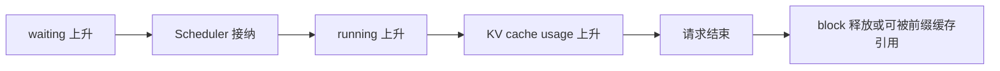

# 启动第一台 vLLM 服务

本实验刻意只用一个小模型、一张 GPU、一个 API 进程。目标不是先跑出最高性能，而是建立一条以后排错都能复用的基线：**版本可记录、配置可解释、请求可复现、指标可观察。**

## 0. 先确认运行边界

课程源码固定在 `61141ed`，你通过 PyPI 安装到的发布版不一定与它完全相同。因此实验记录第一行永远写版本：

```bash
nvidia-smi
python --version
vllm --version
python -c 'import torch; print(torch.__version__, torch.version.cuda); print(torch.cuda.get_device_name())'
```

如果 `nvidia-smi` 都看不到 GPU，先解决驱动或容器的设备映射；不要用 vLLM 参数掩盖基础环境问题。当前官方 Quickstart 支持的 Python 与硬件后端会变化，安装前以[官方安装说明](https://docs.vllm.ai/en/stable/getting_started/installation/)为准。

### 一个干净环境

以下是 NVIDIA CUDA 环境的最短路径：

```bash
uv venv --python 3.12 --seed
source .venv/bin/activate
uv pip install vllm --torch-backend=auto
```

若服务器已有团队维护的 CUDA / PyTorch 镜像，优先在那个镜像中安装兼容版本。不要在一次实验里同时升级驱动、PyTorch 和 vLLM，否则失败时没有可归因的变量。

## 1. 用保守配置启动

下面的小模型便于教学；可以把 `MODEL` 换成你已有权限且显存能容纳的 instruct 模型。

```bash
export MODEL=Qwen/Qwen3-0.6B
export MODEL_REVISION=c1899de289a04d12100db370d81485cdf75e47ca

vllm serve "$MODEL" \
  --revision "$MODEL_REVISION" \
  --tokenizer-revision "$MODEL_REVISION" \
  --host 127.0.0.1 \
  --port 8000 \
  --max-model-len 4096 \
  --gpu-memory-utilization 0.80 \
  --generation-config vllm
```

这里每个非默认参数都有理由：

| 参数 | 本实验为什么显式写出 |
| --- | --- |
| `--host 127.0.0.1` | 默认不把无鉴权接口暴露到公网 |
| `--revision` / `--tokenizer-revision` | 模型权重、配置与 tokenizer 固定到同一个不可变提交，避免重跑时悄悄读取更新后的 `main` |
| `--max-model-len 4096` | 控制实验所需 KV 容量，避免模型声明的超长上下文吃掉余量 |
| `--gpu-memory-utilization 0.80` | 给同机桌面、监控或其他进程留空间；它不是“模型占 80%” |
| `--generation-config vllm` | 不隐式采用模型仓库里的采样默认值，便于对照实验 |

启动日志至少回答四件事：加载了什么模型与 dtype、用了哪张设备、KV cache 有多少 token 容量、是否完成编译/CUDA Graph 捕获。把完整启动日志保留；后面出现 OOM 或吞吐差时，它比一张最终结果截图更有用。

::: warning 远程访问
需要从个人 PC 访问时，先用 SSH 隧道：`ssh -L 8000:127.0.0.1:8000 user@server`。若确实要监听 `0.0.0.0`，至少设置 `--api-key`，并在反向代理上做 TLS、鉴权和限流；API key 不能替代完整的公网安全边界。
:::

## 2. 做三层健康检查

### 层一：进程和模型列表

```bash
curl -s http://127.0.0.1:8000/v1/models | python -m json.tool
```

这只能证明 HTTP 前端和引擎握手成功，不能证明生成链路正确。

### 层二：确定性非流式请求

```bash
curl -s http://127.0.0.1:8000/v1/chat/completions \
  -H 'Content-Type: application/json' \
  -d "{
    \"model\": \"$MODEL\",
    \"messages\": [{\"role\": \"user\", \"content\": \"只回答数字：7乘以8等于多少？\"}],
    \"temperature\": 0,
    \"max_tokens\": 16
  }" | python -m json.tool
```

检查返回的 `model`、`choices[0].finish_reason` 和 `usage`，而不只看一句文本。`finish_reason=length` 常常说明 `max_tokens` 太小，并不代表模型自然结束。

### 层三：流式请求

```bash
curl -N http://127.0.0.1:8000/v1/chat/completions \
  -H 'Content-Type: application/json' \
  -d "{
    \"model\": \"$MODEL\",
    \"messages\": [{\"role\": \"user\", \"content\": \"用三句话解释 KV Cache。\"}],
    \"temperature\": 0,
    \"max_tokens\": 96,
    \"stream\": true
  }"
```

观察第一个 SSE chunk 到达的时间与后续 chunk 间隔。它们分别接近用户感知的 TTFT 和 ITL；总耗时不能替代这两个指标。

## 3. 看见引擎内部状态

V1 通过 Prometheus 兼容端点暴露指标：

```bash
curl -s http://127.0.0.1:8000/metrics \
  | rg 'vllm:(num_requests_running|num_requests_waiting|kv_cache_usage_perc|prefix_cache_)'
```

单请求太快时，在另一个终端并发发请求再观察。此时你应该能把指标与心智模型对应起来：



指标名可能随发布版演进。课程固定提交的设计文档列出的核心 V1 指标包括 `vllm:num_requests_running`、`vllm:num_requests_waiting`、`vllm:kv_cache_usage_perc`、`vllm:prefix_cache_queries` 和 `vllm:prefix_cache_hits`；实际环境以 `/metrics` 输出为真。

## 4. 做一次受控失败

把请求中的 `max_tokens` 设为 2，确认 `finish_reason` 变成 `length`；然后恢复。再发送一个使“输入 token + 最大输出 token”超过 `--max-model-len` 的请求，阅读返回的 4xx 错误。

受控失败能验证三件事：参数约束在哪里检查、错误是否能回到客户端、监控能否区分用户输入错误与服务异常。生产系统不能只验证 happy path。

## 常见启动故障

| 症状 | 先查什么 | 不要先做什么 |
| --- | --- | --- |
| 加载权重时 OOM | 模型参数量、dtype、其他进程、TP | 盲目调低批 token；此时 KV 甚至还没建好 |
| profile / KV 分配时 OOM | `max_model_len`、显存余量、利用率 | 假设模型权重太大 |
| CUDA Graph 捕获时 OOM | 启动日志、并发上限；开发时试 `--enforce-eager` | 把 eager 当永久性能方案 |
| 请求返回乱码或角色混乱 | 模型是否有正确 chat template | 先调 Scheduler |
| 首次启动很慢 | 权重下载、compile、graph capture 分段计时 | 把全部时间归因于模型加载 |

## 实验记录模板

```text
date / git-or-package-version:
GPU / driver / torch / CUDA:
model / revision / dtype:
all non-default server args:
weight load time / compile time / ready time:
KV capacity from startup log:
test prompt input tokens / output tokens / finish reason:
TTFT / ITL / E2E (if measured):
unexpected log or metric:
```

## 通关标准

你需要能解释：为什么“端口打开”不等于“服务正确”；为什么先绑定回环地址；为什么 `gpu_memory_utilization`、`max_model_len` 和可并发 KV 容量有关；以及一次流式请求怎样从 TTFT 进入逐 token 的 ITL 阶段。随后进入[基准测试与调参](./benchmark)。
